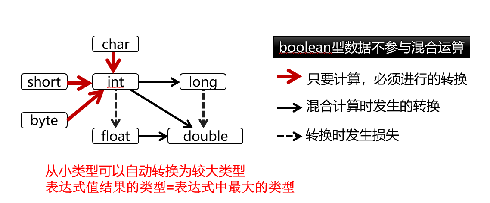

# 数据类型与变量常量

## 数据类型

### 基本数据类型
| 数据类型 | 关键字    | 成员默认值           | 位数 | 取值范围                      |
| -------- | --------- | -------------------- | ---- | ----------------------------- |
| 字节型   | `byte`    | `(byte)0`            | 8    | `-128~127`                    |
| 短整型   | `short`   | `(short)0`           | 16   | `-32768~32767`                |
| 整型     | `int`     | `(int)0 / 0`         | 32   | `-2^31~2^31-1`                |
| 长整型   | `long`    | `(long)0 / 0L / 0l`  | 64   | `-2^63~2^63-1`                |
| 字符型   | `char`    | `(char)0 / '\u0000'` | 16   | `0~65535`                     |
| 浮点型   | `float`   | `(float)0 / 0.0F`    | 32   | `1位符号, 8位指数, 23位尾数`  |
| 双精度型 | `double`  | `(double)0 / 0.0 / 0.0D`   | 64   | `1位符号, 11位指数, 52位尾数` |
| 布尔型   | `boolean` | `false`              | 1    | `true`, `false`               |


#### 数值类型

##### 整型
默认类型为int，如果需要使用更大的数，则使用long类型。
##### 浮点型

说明：在java中的实数型常量默认为double，所以写单精度的实数时要在数字后面写`f`，如`3.14f`。
   `float a=3.4;`(报错) `float a=3.4f;`

浮点型可能会有精度丢失，运算不够精确，不能对其进行精确的`==`运算

采用`BigDecimal`类进行精确运算，Java 提供了两个用于高精度计算的类: `BigInteger` and `BigDecimal`.必须以方法调用方式取代运算符方式来实现 


#### 字符类型
Java中的字符采用Unicode字符集的编码方案，是16位的无符号整数，其前128个字符编码与ASCII码兼容。

**字符常量**：用一对单引号括起的单个字符。

**可见字符**：'a'，'Z'，'8'，'#' 

**转义字符**
| 转义字符 | 含义                     | unicode           |
| -------- | ------------------------ | ----------------- |
| `\0`     | 空字符                   | `\u0000`          |
| `\b`     | 退格                     | `\u0008`          |
| `\t`     | 水平制表符               | `\u0009`          |
| `\n`     | 换行                     | `\u000a`          |
| `\f`     | 换页                     | `\u000c`          |
| `\r`     | 回车                     | `\u000d`          |
| `\"`     | 双引号                   | `\u0022`          |
| `\'`     | 单引号                   | `\u0027`          |
| `\\`     | 反斜杠                   | `\u005c`          |
| `\ddd`   | 三位八进制数表示的字符   | `\u0000`~`\u00ff` |
| `\uxxxx` | 四位十六进制数表示的字符 | `\u0000`~`\u00ff` |


### 引用数据类型

class、interface、array、enum、annotation、record
...


## 常量
常量是程序运行过程中不能被改变的量。

`final`关键字修饰的变量就是常量。

## 变量
变量是程序运行过程中可以被改变的量。

用 `var` 关键字声明的变量，编译器会根据变量初始值的类型自动推断变量的类型。


## 类型转换

当表达式中出现了多种类型数据的混合运算时,需要进行类型转换。




:::details 自动类型转换
这是一个非常好的问题！Java **确实有自动类型转换**（也叫**隐式类型转换**），但它是**有前提条件和限制的**。我们来详细解释一下 Java 的自动类型转换机制。


## ✅ 一、什么是自动类型转换（Implicit Type Conversion）？

在 Java 中，当把一个“小范围”的数据赋值给一个“大范围”的变量时，Java 会自动进行类型转换，无需手动加 `(type)` 进行强制转换。

### 示例：
```java
int a = 100;
long b = a;   // 自动类型转换：int -> long

byte c = 10;
int d = c;    // byte -> int 自动转换
```

这叫做**向上转型（Widening Primitive Conversion）**，是安全的，不会丢失数据。


## ❌ 二、为什么有些情况不能自动转换？

Java **不会自动进行可能导致精度丢失或溢出的转换**，这种转换需要你显式地告诉编译器：“我知道可能有问题，但我愿意承担这个风险”。

### 常见不会自动转换的情况：

| 类型转换方向         | 是否自动转换？ | 说明 |
|----------------------|----------------|------|
| `double` → `float`   | ❌             | 可能丢失精度 |
| `float` → `long`     | ❌             | 同上 |
| `int` → `short`      | ❌             | 超过范围会有溢出 |
| `int` → `byte`       | ❌             | 同上 |
| `long` → `int`       | ❌             | 可能溢出 |

### 示例错误代码：
```java
int a = 1.2345;      // double → int ❌
byte b = 128;        // 128 超出 byte 范围 ❌
float c = 1.5;       // double → float ❌
```

---

## 🔄 三、运算中的自动类型提升（Type Promotion）

Java 在做算术运算时，会对某些类型自动提升为 `int` 或更高。

例如：
```java
byte b = 1;
b = b + 1;  // ❌ 编译错误：b+1 是 int 类型，不能直接赋给 byte
```

因为 `byte` 和 `short` 在参与运算时会被自动提升为 `int`，所以表达式结果也是 `int` 类型。你要想赋值回 `byte`，必须强制转换：

```java
b = (byte)(b + 1); // ✅ 显式转换
```

---

## ✅ 四、可以自动转换的顺序（从小到大）

以下是 Java 基本数据类型的大小顺序（用于自动转换）：

```java
byte → short → int → long → float → double
```

- 小转大：✅ 自动转换
- 大转小：❌ 必须强制转换

---

## 📝 总结

| 情况                     | 是否自动转换 | 原因说明 |
|--------------------------|---------------|-----------|
| 小类型赋值给大类型       | ✅            | 不会丢失信息 |
| 大类型赋值给小类型       | ❌            | 可能溢出或精度丢失，需强制转换 |
| 浮点字面量赋值给 float   | ❌            | 默认是 double，要加 `f` |
| byte/short 参与运算后赋值| ❌            | 会自动提升为 int，赋值回去要强转 |
| boolean 和其他类型互转   | ❌            | Java 不允许任何类型和 boolean 互转 |

:::


:::details 包装类

好的！我们来从最基础讲起：**Java 中的包装类（Wrapper Class）是什么？为什么要有它？它是怎么用的？**

## 📦 一、什么是包装类？

在 Java 中，**基本数据类型**（如 `int`、`double`、`boolean` 等）不是对象，它们不能被当作对象使用。为了能在面向对象的语言中使用这些基本类型，Java 引入了 **包装类（Wrapper Class）**。

### ✅ 每个基本类型都有一个对应的包装类：

| 基本类型 | 包装类     |
|----------|------------|
| `byte`   | `Byte`     |
| `short`  | `Short`    |
| `int`    | `Integer`  |
| `long`   | `Long`     |
| `float`  | `Float`    |
| `double` | `Double`   |
| `char`   | `Character`|
| `boolean`| `Boolean`  |


## 🧠 二、为什么要用包装类？

Java 是一门面向对象的语言，很多地方都要求使用“对象”，比如：

### 1. **集合框架（Collection Framework）只能存储对象**
```java
List<int> list = new ArrayList<>(); // ❌ 编译错误
List<Integer> list = new ArrayList<>(); // ✅ 正确
```

### 2. **泛型（Generic）不支持基本类型**
```java
Map<String, int> map = new HashMap<>(); // ❌ 错误
Map<String, Integer> map = new HashMap<>(); // ✅ 正确
```

### 3. **可以表示 null 值**
- `int` 默认值是 `0`
- `Integer` 可以为 `null`，表示“没有值”

这在数据库查询、接口返回等场景非常有用。

## 🔁 三、自动拆箱和自动装箱（Autoboxing & Unboxing）

从 Java 5 开始，Java 提供了 **自动装箱** 和 **自动拆箱** 的功能，简化了基本类型与包装类之间的转换。

### ✅ 自动装箱（Primitive → Wrapper）
```java
Integer a = 10; // 自动装箱：int -> Integer
```

### ✅ 自动拆箱（Wrapper → Primitive）
```java
int b = a; // 自动拆箱：Integer -> int
```

### 示例：
```java
List<Integer> list = new ArrayList<>();
list.add(5);       // 自动装箱：int -> Integer
int value = list.get(0); // 自动拆箱：Integer -> int
```


## ⚠️ 四、注意事项（常见坑点）

### 1. `==` vs `.equals()` 对比

```java
Integer a = 100;
Integer b = 100;
System.out.println(a == b);      // true（缓存机制）

Integer c = 200;
Integer d = 200;
System.out.println(c == d);      // false（超出缓存范围）

System.out.println(c.equals(d)); // true（内容相等）
```

#### 💡 原因：
- Java 对 `-128 ~ 127` 范围内的整数做了缓存优化。
- 超出这个范围会创建新对象。
- 所以比较两个 `Integer` 是否相等，建议用 `.equals()` 方法！

### 2. NullPointerException（NPE）

```java
Integer e = null;
int f = e; // 报错：NullPointerException
```

⚠️ 使用自动拆箱时要注意 `null` 值！


## 🧪 五、常用方法（以 Integer 为例）

| 方法名              | 功能说明                             |
|---------------------|--------------------------------------|
| `Integer.valueOf(int)` | 将 int 转为 Integer（推荐方式）     |
| `Integer.parseInt(String)` | 将字符串转为 int                 |
| `new Integer(int)`       | 构造函数，已过时                   |
| `intValue()`             | 将 Integer 转回 int                |

### 示例：
```java
String str = "123";
int num = Integer.parseInt(str);        // 字符串转 int
Integer wrapper = Integer.valueOf(num); // int 转 Integer
int back = wrapper.intValue();          // Integer 转回 int
```


## 🧱 六、总结一句话

> **包装类就是为了让基本类型也能当对象用而设计的，有了自动装箱/拆箱后，使用起来更方便，但也要注意 null 和比较陷阱等问题。**


## 📚 七、扩展阅读（进阶）

如果你感兴趣，我还可以继续讲：
- 如何自定义包装类？
- 包装类的源码分析（如 `Integer` 内部如何实现缓存）
- `Optional<Integer>` 的使用
- `IntStream`、`boxed()` 等现代 Java 特性中的包装类应用

:::


