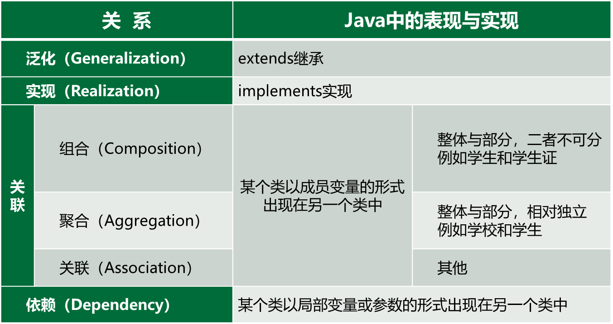

# 类和对象

## 面向过程与面向对象


### 面向过程

在面向过程的程序设计中，问题被看作是一系列**需要完成**的**功能模块**。

**函数**（泛指高级语言实现功能模块的实体），用于完成这些任务。

解决问题的**焦点**在于编写**函数**。函数是**面向过程**的，它关注的是如何依据规定的条件，完成指定的任务。

在多函数程序中，许多重要的数据被放置在**全局数据**区。这样，它们可以被所有的函数访问（每个函数还可以具有它们自己的局部数据）。这种数据和对数据的操作相分离的结构，**很容易**造成全局数据在没有任何协商的情况下被改动，因而程序的正确性不易保证。

### 面向对象

面向对象的程序设计，将数据和对数据的操作行为**封装**在一起，作为一个相互依存、不可分割的整体——类。类中的大多数数据，只能为本类的行为所使用。类会提供公开的外部接口，与外界进行通信。

类是抽象的数据类型，通过类来创建对象。

程序的执行，表现为一组对象之间的交互通信。对象之间通过公共接口进行通信，从而完成系统功能。

面向对象的程序模块间关系简单，程序的独立性高、数据安全。面向对象的显著特点包括：**封装性**、**继承性**和**多态性**。 

#### 封装
封装是将对象的属性和操作整合为一个独立整体，并最大限度地隐藏对象内部细节的核心概念。

##### 封装的含义
- **整合属性与服务**：将对象的所有属性和服务紧密结合，形成一个不可分割的独立单元，确保数据与操作的高度内聚。
- **实现信息隐藏**：尽可能地将对象的内部实现细节隐藏起来，构建起与外界交互的边界。仅开放**有限的外部接口**，实现与外界的安全通信。

##### 封装的意义
1. **解决传统编程痛点**：对象的数据封装特性，彻底解决了面向过程编程中数据与操作分离带来的问题，显著提升程序的**可复用性**与**可维护性**，极大减轻了程序员管理分离数据的负担。
2. **强化数据安全**：通过区分对象的**私有数据**和**公有数据**，有效保护敏感信息，减少模块间不必要的干扰，降低程序复杂度，提升系统的可控性。
3. **分离设计与使用**：封装的核心目标在于将对象的设计者与使用者分隔开来。使用者无需了解具体的行为实现细节，仅需通过设计者提供的接口与对象进行交互。
4. **黑盒特性优势**：类具备“黑盒”特性，即使修改数据存储方式，只要保持对外接口不变，其他对象便不会感知内部变化。这就如同公司内部架构调整时，只要面向客户的业务接口稳定，客户便不受影响，保障了系统的稳定性与兼容性。 

## 类与类之间的关系
类与类之间的关系主要有6种：类与类之间的关系，从泛化→实现→组合→聚合→关联→依赖，关系越来越弱。



## 修饰符

### 访问控制修饰符

| 修饰符 | 权限 | 含义 |
| --- | --- | --- |
| `public` | 公共的 | 可以被所有类访问 |
| `private` | 私有的 | 只能被定义它的类访问 |
| `protected` | 受保护的 | 可以被同一个包中的其他类访问，也可以被不同包中的子类访问 |
| `default` | 默认的 | 只能被同一个包中的其他类访问 |


#### 用法

##### 方法和变量

```java
public class MyClass {
    public int publicField;
    private int privateField;
    protected int protectedField;
    int defaultField;
}
```

##### 类
顶层类（非内部类）默认是`default`，可以被同一个包中的其他类访问。
不能用 `protected` 和 `private` 修饰顶层类。

内部类可以有 `public`、`protected`、`private` 和 `default` 四种访问控制修饰符。

```java
public class MyClass {
    private class MyInnerClass {
        public void myMethod() {
            System.out.println("Hello, World!");
        }
    }
}
```


### 非访问控制修饰符

| 修饰符 | 含义 |
| --- | --- |
| `static` | 静态的 | 修饰类变量和类方法 |
| `final` | 最终的 | 修饰类、方法和变量 |
| `abstract` | 抽象的 | 修饰类和方法 |
| `synchronized` | 同步的 | 修饰方法 |
| `volatile` | 易变的 | 修饰变量 |
| `transient` | 瞬态的 | 修饰变量 |

:::details 详细说明

#### static

- **含义**：`static`修饰符用于创建类的静态成员，即静态变量和静态方法。静态成员属于类本身，而不是类的实例。
- **作用**：可以通过类名直接访问静态成员，无需创建类的实例。它为类的所有对象共享，常用于表示类级别的常量、工具方法或全局状态。
- **示例**：
```java
public class MyClass {
    // 静态变量
    public static int staticVar = 10;

    // 静态方法
    public static void staticMethod() {
        System.out.println("这是一个静态方法。");
    }
}

public class Main {
    public static void main(String[] args) {
        // 直接通过类名访问静态变量和静态方法
        System.out.println(MyClass.staticVar);
        MyClass.staticMethod();
    }
}
```

#### final

- **含义**：`final`修饰符表示最终的、不可改变的。可以修饰类、方法和变量。
- **作用**：修饰类时，该类不能被继承；修饰方法时，该方法不能在子类中被重写；修饰变量时，该变量成为常量，只能被赋值一次。
- **示例**：
```java
// final修饰的类，不能被继承
final class FinalClass {
    // final修饰的方法，不能在子类中被重写
    public final void finalMethod() {
        System.out.println("这是一个final方法。");
    }
}

public class Main {
    public static void main(String[] args) {
        // final修饰的变量，只能被赋值一次
        final int finalVar = 20;
        // 以下代码会报错，不能再次给final变量赋值
        // finalVar = 30;
    }
}
```

#### abstract

- **含义**：`abstract`修饰符用于表示抽象的概念，可修饰类和方法。抽象类是一种不能被实例化的类，它通常包含抽象方法。抽象方法是只有方法签名，没有方法体的方法。
- **作用**：用于定义抽象的类型或行为，为子类提供一个通用的模板，子类必须实现抽象类中的抽象方法。
- **示例**：
```java
// 抽象类
abstract class AbstractClass {
    // 抽象方法
    public abstract void abstractMethod();

    // 普通方法
    public void normalMethod() {
        System.out.println("这是一个普通方法。");
    }
}

// 子类必须实现抽象类中的抽象方法
class ConcreteClass extends AbstractClass {
    @Override
    public void abstractMethod() {
        System.out.println("实现抽象方法。");
    }
}

public class Main {
    public static void main(String[] args) {
        ConcreteClass obj = new ConcreteClass();
        obj.abstractMethod();
        obj.normalMethod();
    }
}
```

#### synchronized

- **含义**：`synchronized`修饰符用于实现多线程环境下的同步访问，确保在同一时刻只有一个线程能够访问被同步的代码块或方法。
- **作用**：用于解决多线程并发访问时的数据不一致问题，保证线程安全。
- **示例**：
```java
public class SynchronizedExample {
    private int count = 0;

    // 同步方法
    public synchronized void increment() {
        count++;
    }

    public static void main(String[] args) {
        SynchronizedExample example = new SynchronizedExample();

        // 创建多个线程同时访问同步方法
        Thread thread1 = new Thread(() -> {
            for (int i = 0; i < 1000; i++) {
                example.increment();
            }
        });

        Thread thread2 = new Thread(() -> {
            for (int i = 0; i < 1000; i++) {
                example.increment();
            }
        });

        thread1.start();
        thread2.start();

        // 等待两个线程执行完毕
        try {
            thread1.join();
            thread2.join();
        } catch (InterruptedException e) {
            e.printStackTrace();
        }

        System.out.println("Count: " + example.count);
    }
}
```

#### volatile

- **含义**：`volatile`修饰符用于修饰变量，它保证了变量在多线程环境下的可见性。即当一个线程修改了`volatile`变量的值，其他线程能够立即看到这个变化。
- **作用**：主要用于解决多线程环境下变量的可见性问题，防止线程从自己的工作内存中获取过期的数据。
- **示例**：
```java
public class VolatileExample {
    // volatile修饰的变量
    private volatile boolean flag = false;

    public void setFlag() {
        flag = true;
    }

    public void checkFlag() {
        while (!flag) {
            // 等待flag被设置为true
        }
        System.out.println("Flag is true.");
    }

    public static void main(String[] args) {
        VolatileExample example = new VolatileExample();

        // 创建一个线程来设置flag为true
        Thread thread = new Thread(() -> {
            try {
                Thread.sleep(1000);
            } catch (InterruptedException e) {
                e.printStackTrace();
            }
            example.setFlag();
        });

        // 创建另一个线程来检查flag的值
        Thread checkThread = new Thread(() -> {
            example.checkFlag();
        });

        thread.start();
        checkThread.start();

        // 等待两个线程执行完毕
        try {
            thread.join();
            checkThread.join();
        } catch (InterruptedException e) {
            e.printStackTrace();
        }
    }
}
```

#### transient

- **含义**：`transient`修饰符用于修饰变量，表示该变量在对象序列化时不需要被持久化。
- **作用**：当一个对象被序列化（例如保存到文件或通过网络传输）时，被`transient`修饰的变量不会被包含在序列化的结果中。
- **示例**：
```java
import java.io.FileInputStream;
import java.io.FileOutputStream;
import java.io.IOException;
import java.io.ObjectInputStream;
import java.io.ObjectOutputStream;
import java.io.Serializable;

public class TransientExample implements Serializable {
    private static final long serialVersionUID = 1L;

    // 普通变量，会被序列化
    private int normalVar = 10;

    // transient修饰的变量，不会被序列化
    private transient int transientVar = 20;

    public TransientExample() {
        System.out.println("构造函数被调用。");
    }

    public void printVars() {
        System.out.println("普通变量：" + normalVar + ", 瞬态变量：" + transientVar);
    }

    public static void main(String[] args) {
        TransientExample example = new TransientExample();
        example.printVars();

        // 将对象序列化到文件
        try (ObjectOutputStream oos = new ObjectOutputStream(new FileOutputStream("example.obj"))) {
            oos.writeObject(example);
        } catch (IOException e) {
            e.printStackTrace();
        }

        // 从文件中反序列化对象
        try (ObjectInputStream ois = new ObjectInputStream(new FileInputStream("example.obj"))) {
            TransientExample deserializedExample = (TransientExample) ois.readObject();
            deserializedExample.printVars();
        } catch (IOException | ClassNotFoundException e) {
            e.printStackTrace();
        }
    }
}
```
在上述示例中，`transientVar`变量在对象序列化时不会被保存，因此在反序列化后，它的值将变为该类型的默认值（对于`int`类型，默认值为0）。而`normalVar`变量会被正常序列化和反序列化，保持其原来的值。

:::

## 对象的创建和使用

### 对象的创建

```java
class 类名 {
    // 类体
    类成员
    public 类名(类参数) {
        // 构造方法
    }

    public static void main(String[] args) {
        // 主方法
    }
}

类名 对象名 = new 类名();
```


