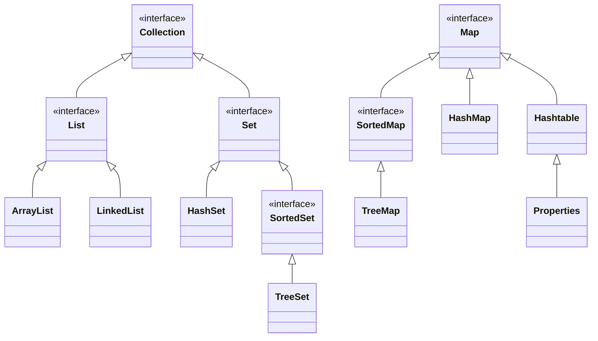

# 集合框架

集合框架是Java中用于存储和操作对象的容器。

Java集合框架的根是两个接口：`Collection`和`Map`。


根据`Collection`和`Map`的架构，Java中的集合可以分为三大类

- `List`：有序集合，它会记录每次添加元素的顺序，元素可以重复；
- `Set`：无序集合，它不记录元素添加的顺序，因此元素不可重复；
- `Map`：键值对的集合，它的每个元素都由键值`key`和取值`value`对应组成，键值和取值分别存储，键值是无序集合`Set`，取值是有序集合`List`。

集合与数组有一个明显的不同，就是在Java的集合中只能存储**对象**，而不能存储基本类型的**数据**。

:::details 区别示例

```java
int[] arr = new int[10];
arr[0] = 1;
arr[1] = 2;
arr[2] = 3;

List<Integer> list = new ArrayList<>();
list.add(1);
list.add(2);
list.add(3);
```

数组存的是基本数据类型，集合存的是对象（包装类）。
::: 
