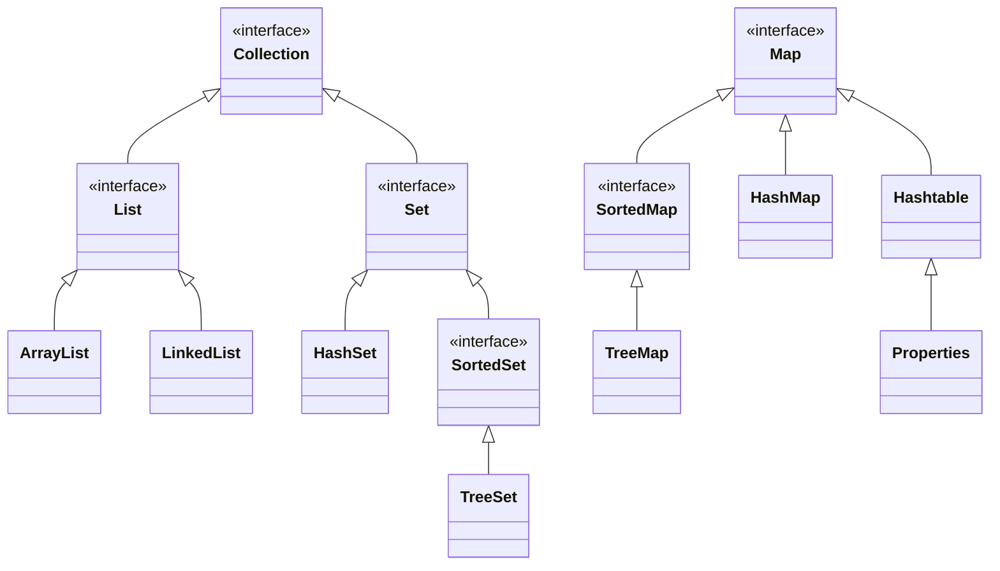

# 集合

集合框架是Java中用于存储和操作对象的容器。

Java集合框架的根是两个接口：Collection和Map。

```mermaid
classDiagram
    class Collection {
        <<interface>>
    }
    class List {
        <<interface>>
    }
    class Set {
        <<interface>>
    }
    class SortedSet {
        <<interface>>
    }
    class Map {
        <<interface>>
    }
    class SortedMap {
        <<interface>>
    }

    class ArrayList
    class LinkedList
    class HashSet
    class TreeSet
    class HashMap
    class TreeMap
    class Hashtable
    class Properties

    Collection <|-- List
    Collection <|-- Set
    List <|-- ArrayList
    List <|-- LinkedList
    Set <|-- HashSet
    Set <|-- SortedSet
    SortedSet <|-- TreeSet

    Map <|-- SortedMap
    Map <|-- HashMap
    Map <|-- Hashtable
    SortedMap <|-- TreeMap
    Hashtable <|-- Properties
```
