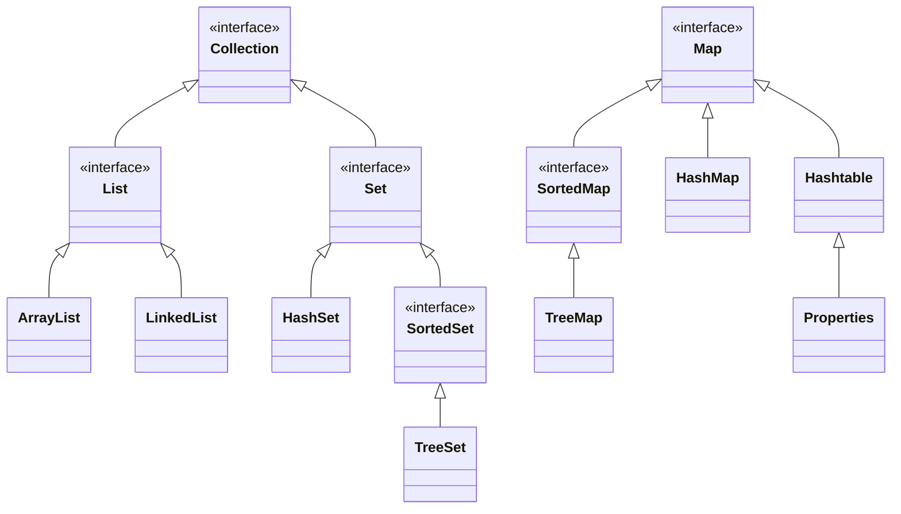

# 集合

## 集合框架

集合框架是Java中用于存储和操作对象的容器。

Java集合框架的根是两个接口：`Collection`和`Map`。


根据`Collection`和`Map`的架构，Java中的集合可以分为三大类

- `List`：有序集合，它会记录每次添加元素的顺序，元素可以重复；
- `Set`：无序集合，它不记录元素添加的顺序，因此元素不可重复；
- `Map`：键值对的集合，它的每个元素都由键值`key`和取值`value`对应组成，键值和取值分别存储，键值是无序集合`Set`，取值是有序集合`List`。

集合与数组有一个明显的不同，就是在Java的集合中只能存储**对象**，而不能存储基本类型的**数据**。

:::details 区别示例

```java
int[] arr = new int[10];
arr[0] = 1;
arr[1] = 2;
arr[2] = 3;

List<Integer> list = new ArrayList<>();
list.add(1);
list.add(2);
list.add(3);
```

数组存的是基本数据类型，集合存的是对象（包装类）。
:::


## 迭代器

迭代器是用于遍历集合的工具。在 Java 里，`Iterator`接口为集合元素的遍历提供了支持。通过使用迭代器，能够按照顺序逐个访问集合中的元素，同时还可以在遍历过程中对元素进行移除操作。

### 迭代器的基本使用
下面是使用迭代器遍历`List`集合的示例代码：
```java
import java.util.ArrayList;
import java.util.Iterator;
import java.util.List;

public class IteratorExample {
    public static void main(String[] args) {
        // 创建一个 List 集合
        List<String> list = new ArrayList<>();
        list.add("apple");
        list.add("banana");
        list.add("cherry");

        // 获取迭代器
        Iterator<String> iterator = list.iterator();

        // 使用迭代器遍历集合
        while (iterator.hasNext()) {
            String element = iterator.next();
            System.out.println(element);
        }
    }
}
```
在上述代码中：
1. 首先创建了一个`ArrayList`集合，并且添加了几个元素。
2. 接着调用集合的`iterator()`方法获取一个迭代器对象。
3. 然后运用`while`循环和迭代器的`hasNext()`方法来检查是否还有下一个元素，若有则使用`next()`方法获取该元素并打印。

### 迭代器的移除操作
迭代器还提供了`remove()`方法，可在遍历过程中移除元素。示例如下：
```java
import java.util.ArrayList;
import java.util.Iterator;
import java.util.List;

public class IteratorRemoveExample {
    public static void main(String[] args) {
        List<String> list = new ArrayList<>();
        list.add("apple");
        list.add("banana");
        list.add("cherry");

        Iterator<String> iterator = list.iterator();
        while (iterator.hasNext()) {
            String element = iterator.next();
            if (element.equals("banana")) {
                iterator.remove();
            }
        }

        System.out.println(list);
    }
}
```
在这个示例中，当遍历到元素`"banana"`时，调用`iterator.remove()`方法将其从集合里移除。

### `ListIterator`
对于`List`集合，还有一种特殊的迭代器`ListIterator`，它不仅具备`Iterator`的功能，还能进行双向遍历以及在遍历过程中添加元素。示例如下：
```java
import java.util.ArrayList;
import java.util.List;
import java.util.ListIterator;

public class ListIteratorExample {
    public static void main(String[] args) {
        List<String> list = new ArrayList<>();
        list.add("apple");
        list.add("banana");
        list.add("cherry");

        ListIterator<String> listIterator = list.listIterator();

        // 正向遍历
        while (listIterator.hasNext()) {
            System.out.println(listIterator.next());
        }

        // 反向遍历
        while (listIterator.hasPrevious()) {
            System.out.println(listIterator.previous());
        }

        // 在遍历过程中添加元素
        listIterator = list.listIterator();
        while (listIterator.hasNext()) {
            if (listIterator.next().equals("banana")) {
                listIterator.add("date");
            }
        }

        System.out.println(list);
    }
}
```
在上述代码中，先使用`ListIterator`进行正向遍历，再进行反向遍历，最后在遍历过程中当遇到元素`"banana"`时添加元素`"date"`。

## 泛型

### 泛型的概念
泛型是 Java 5 引入的一个新特性，它提供了编译时类型安全检测机制，该机制允许在编译时检测到非法的类型。泛型的本质是参数化类型，也就是说所操作的数据类型被指定为一个参数。这种参数类型可以用在类、接口和方法的创建中，分别称为泛型类、泛型接口、泛型方法。

### 泛型类
泛型类是在定义类时使用泛型。以下是一个简单的泛型类示例：
```java
// 定义一个泛型类
class Box<T> {
    private T t;

    public void set(T t) {
        this.t = t;
    }

    public T get() {
        return t;
    }
}

public class GenericClassExample {
    public static void main(String[] args) {
        // 创建一个存储 Integer 类型的 Box 对象
        Box<Integer> integerBox = new Box<>();
        integerBox.set(10);
        Integer num = integerBox.get();
        System.out.println("Integer value: " + num);

        // 创建一个存储 String 类型的 Box 对象
        Box<String> stringBox = new Box<>();
        stringBox.set("Hello");
        String str = stringBox.get();
        System.out.println("String value: " + str);
    }
}
```
在上述代码中，`Box` 类是一个泛型类，`T` 是类型参数。在创建 `Box` 对象时，可以指定具体的类型，如 `Integer` 或 `String`。

### 泛型接口
泛型接口与泛型类的定义和使用方式类似。以下是一个泛型接口的示例：
```java
// 定义一个泛型接口
interface Generator<T> {
    T next();
}

// 实现泛型接口
class FruitGenerator implements Generator<String> {
    private String[] fruits = {"Apple", "Banana", "Cherry"};
    private int index = 0;

    @Override
    public String next() {
        if (index < fruits.length) {
            return fruits[index++];
        }
        return null;
    }
}

public class GenericInterfaceExample {
    public static void main(String[] args) {
        FruitGenerator generator = new FruitGenerator();
        String fruit = generator.next();
        while (fruit != null) {
            System.out.println(fruit);
            fruit = generator.next();
        }
    }
}
```
在这个例子中，`Generator` 是一个泛型接口，`FruitGenerator` 类实现了该接口并指定了具体的类型为 `String`。

### 泛型方法
泛型方法是在定义方法时使用泛型。以下是一个泛型方法的示例：
```java
public class GenericMethodExample {
    // 定义一个泛型方法
    public static <T> void printArray(T[] array) {
        for (T element : array) {
            System.out.print(element + " ");
        }
        System.out.println();
    }

    public static void main(String[] args) {
        // 创建一个 Integer 数组
        Integer[] intArray = {1, 2, 3, 4, 5};
        // 创建一个 String 数组
        String[] stringArray = {"Hello", "World"};

        // 调用泛型方法打印 Integer 数组
        printArray(intArray);
        // 调用泛型方法打印 String 数组
        printArray(stringArray);
    }
}
```
在上述代码中，`printArray` 是一个泛型方法，它可以接受任何类型的数组作为参数。

### 泛型的好处
- **类型安全**：泛型的主要目标是提高 Java 程序的类型安全。通过使用泛型，编译器可以在编译时检查类型错误，避免在运行时出现 `ClassCastException`。
- **代码复用**：泛型允许编写通用的代码，这些代码可以处理不同类型的数据，从而提高了代码的复用性。
- **可读性**：泛型代码更具可读性，因为它清楚地表明了所处理的数据类型。

### 泛型的通配符
在使用泛型时，有时需要使用泛型通配符来表示未知类型。Java 提供了三种通配符：
- **无界通配符 `<?>`**：表示未知类型。例如，`List<?>` 表示一个元素类型未知的列表。
- **上界通配符 `<? extends T>`**：表示类型是 `T` 或 `T` 的子类。例如，`List<? extends Number>` 表示一个元素类型是 `Number` 或其子类的列表。
- **下界通配符 `<? super T>`**：表示类型是 `T` 或 `T` 的父类。例如，`List<? super Integer>` 表示一个元素类型是 `Integer` 或其父类的列表。

以下是一个使用通配符的示例：
```java
import java.util.ArrayList;
import java.util.List;

class Animal {}
class Dog extends Animal {}
class Cat extends Animal {}

public class WildcardExample {
    // 使用上界通配符
    public static void printAnimals(List<? extends Animal> animals) {
        for (Animal animal : animals) {
            System.out.println(animal);
        }
    }

    public static void main(String[] args) {
        List<Dog> dogs = new ArrayList<>();
        dogs.add(new Dog());
        dogs.add(new Dog());

        List<Cat> cats = new ArrayList<>();
        cats.add(new Cat());
        cats.add(new Cat());

        printAnimals(dogs);
        printAnimals(cats);
    }
}
```
在这个例子中，`printAnimals` 方法使用了上界通配符 `<? extends Animal>`，这意味着它可以接受任何元素类型是 `Animal` 或其子类的列表。
